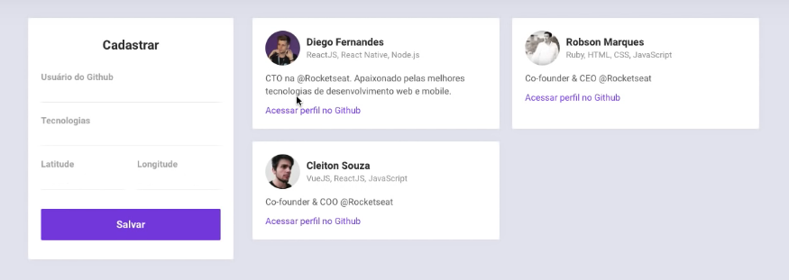
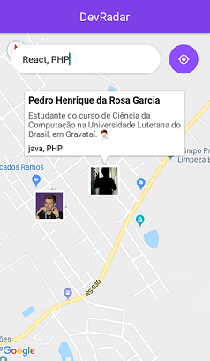

<h1 align="center">
  :rocket: Semana OmniStack 10.0 :rocket:
</h1>

  

  
  
  
  
  

---
## Projeto
O **DevRadar** é um projeto que visa conectar desenvolvedores próximos a você que trabalham com as mesmas tecnologias.  
O desenvolvimento ocorreu durante a semana Omnistack da [Rocketseat](https://rocketseat.com.br/).
 

- ## :computer: Web
 

- ## :iphone: Mobile
 

---
## Tecnologias

Esse projeto utilizou as seguintes tecnologias:

- [Node.js](https://nodejs.org/en/)
- [Socket.io](https://socket.io/)
- [MongoDB](https://www.mongodb.com/)
- [React](https://reactjs.org)
- [React Native](https://facebook.github.io/react-native/)
- [Expo](https://expo.io/)

---
## Licença

[LICENSE](LICENSE) & [Rocketseat](https://rocketseat.com.br/)

---
:squirrel:

